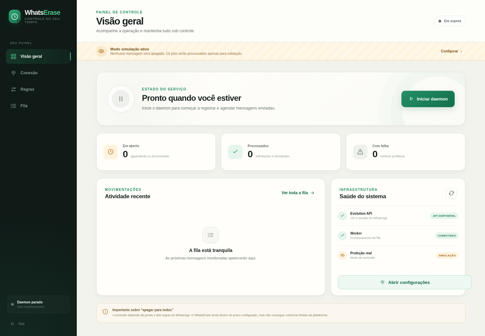
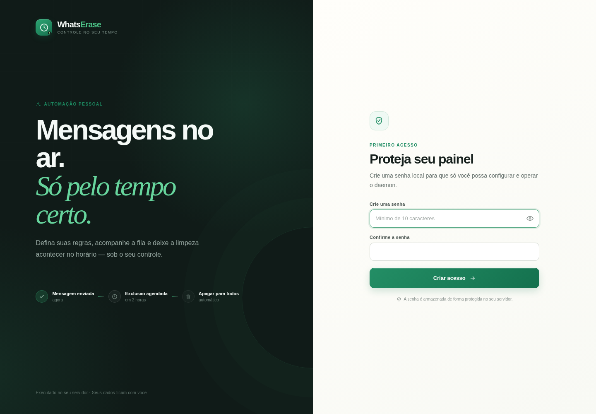
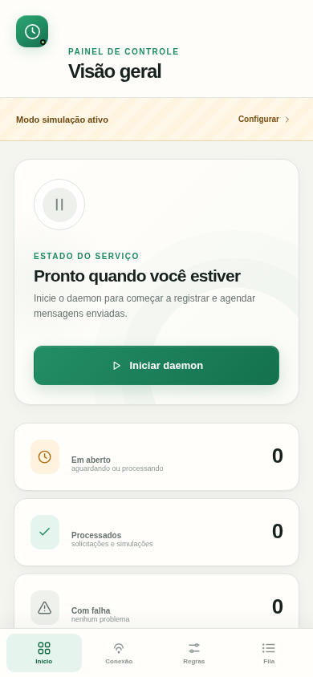
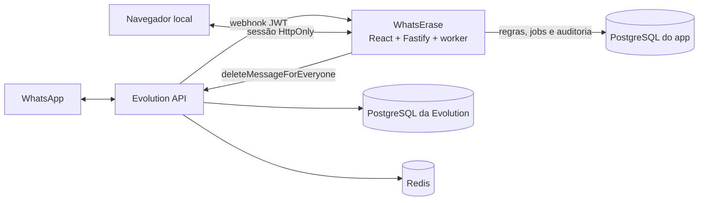

# WhatsErase

Automação self-hosted para agendar solicitações de **“Apagar para todos”** em mensagens enviadas pela sua própria conta do WhatsApp.

[](https://github.com/osdeving/whats-erase/actions/workflows/ci.yml)




> [!CAUTION]
> Este projeto usa Evolution API/Baileys e **não é uma integração oficial do WhatsApp**. Mudanças na plataforma podem interromper o funcionamento ou causar restrições na conta. Um retorno HTTP de sucesso indica que a solicitação de revogação foi enviada — não comprova que a mensagem desapareceu de todos os aparelhos.

O WhatsErase observa somente mensagens novas enviadas pela própria conta (`fromMe: true`), escolhe uma regra, grava um job durável e pede a revogação no horário configurado. Tudo roda na sua infraestrutura, com painel local, modo simulação e auditoria sanitizada.

## Recursos

- conexão guiada por QR Code com uma instância `WHATSAPP-BAILEYS`;
- regras por todas as conversas, conversa direta, grupo ou JID exato;
- filtros por texto, imagem, vídeo, áudio, documento, figurinha e outros;
- ação **apagar depois de X** ou **nunca apagar**;
- regra protetiva “nunca apagar” com precedência sobre regras de exclusão;
- fila durável em PostgreSQL com deduplicação, lease, retry e backoff;
- modo simulação gravado no próprio job, evitando exclusões acidentais posteriores;
- dashboard, fila, logs operacionais e teste de job pelo painel;
- senha local, cookie `HttpOnly` e segredos cifrados com AES-256-GCM;
- webhook assinado por JWT e portas publicadas somente em `127.0.0.1`;
- launcher opcional para Windows/WSL, popup nativo de QR e `Ctrl+Alt+Shift+E`;
- interface responsiva para desktop e celular.

Escopo atual: uma instalação pessoal, um operador e uma instância principal do WhatsApp.

## Telas

As capturas abaixo usam dados de demonstração. Nenhum contato, QR Code ou credencial real aparece nas imagens.

<table>
  <tr>
    <td width="70%"></td>
    <td width="30%"></td>
  </tr>
  <tr>
    <td align="center"><strong>Primeiro acesso protegido por senha local</strong></td>
    <td align="center"><strong>Interface responsiva</strong></td>
  </tr>
</table>

## Como funciona

1. A Evolution recebe uma mensagem enviada pela conta conectada.
2. O webhook autenticado entrega o evento ao WhatsErase.
3. O backend aceita apenas a instância configurada, mensagens próprias e eventos posteriores ao início do daemon.
4. O motor escolhe a regra aplicável; qualquer regra `keep` correspondente vence uma exclusão.
5. Um job é persistido no PostgreSQL com o horário de execução e um snapshot da decisão.
6. O worker reivindica jobs vencidos com `FOR UPDATE SKIP LOCKED` e solicita a revogação à Evolution.
7. Resultado, retries e eventos correlatos aparecem na fila e nos logs sanitizados.



O Redis pertence à Evolution; a fila do WhatsErase fica no PostgreSQL do app.

## Início rápido

### Requisitos

- Docker 28+ com Docker Compose v2;
- `openssl`, `sed` e `tr` para gerar o `.env`;
- portas locais `3210` e `18080` livres;
- Linux, macOS ou Windows com WSL/Docker funcionando.

### Instalação

```bash
git clone https://github.com/osdeving/whats-erase.git
cd whats-erase

chmod +x scripts/setup.sh
./scripts/setup.sh
docker compose up -d --build
```

Abra [http://localhost:3210](http://localhost:3210) e siga o primeiro acesso:

1. crie a senha local do painel;
2. em **Conexão**, mantenha os valores entregues pelo Compose e clique em **Testar conexão**;
3. crie a instância `whats-erase`, carregue o QR e leia-o em **WhatsApp → Aparelhos conectados**;
4. configure o atraso e as regras;
5. mantenha **Modo simulação** ligado no primeiro teste;
6. inicie o daemon, envie uma mensagem nova e acompanhe a fila;
7. somente depois de validar o fluxo, pare o daemon, desligue a simulação e inicie novamente.

Cada job preserva o modo vigente no momento da captura. Um job criado em simulação nunca vira exclusão real apenas porque a configuração foi alterada depois.

## Launcher para Windows + WSL

Depois da instalação inicial, execute uma vez dentro da distribuição WSL:

```bash
./scripts/install-windows-shortcuts.sh
```

O instalador descobre o usuário, a distribuição e o caminho atuais e cria:

| Atalho | Comportamento |
| --- | --- |
| **WhatsErase** na Área de Trabalho | Sobe a pilha e verifica a conexão |
| **Iniciar** no Menu Iniciar | Mesmo fluxo, com `Ctrl+Alt+Shift+E` quando a combinação está livre |
| **Painel** | Sobe a pilha e abre `http://localhost:3210` |
| **Encerrar** | Pede confirmação, pausa o daemon e executa `docker compose stop` |

Se o WhatsApp estiver desconectado, **Iniciar** exibe o QR em uma janela nativa. Se já estiver pronto, mostra apenas uma notificação. QR, credenciais e respostas brutas não entram no log do launcher.

Nada é adicionado à inicialização do Windows, ao Agendador de Tarefas ou à pasta Startup. Os containers usam `restart: unless-stopped`; use **Encerrar** antes de desligar se quiser garantir que permaneçam parados quando WSL/Docker voltar.

Log sanitizado do launcher:

```text
%LOCALAPPDATA%\WhatsErase\launcher.log
```

## Regras e precedência

Uma regra pode combinar:

- escopo: todas, diretas, grupos ou JID exato;
- tipo: todos, texto, imagem, vídeo, áudio, documento, figurinha ou outros;
- ação: apagar depois de um atraso ou nunca apagar;
- prioridade numérica.

Qualquer regra `keep` correspondente é protetiva e vence regras de exclusão. Entre exclusões, prioridade e especificidade determinam a escolhida. A decisão original fica no job, mas regras protetivas também são reavaliadas imediatamente antes da chamada.

O painel limita atrasos a **47 horas**, deixando margem dentro da janela aproximada de dois dias usada pelo WhatsApp para “Apagar para todos”.

## Estados da fila

| Estado | Significado |
| --- | --- |
| `pending` | Aguardando o horário configurado |
| `processing` | Requisição em andamento |
| `retry` | Falha temporária; nova tentativa agendada |
| `deleted` | A Evolution aceitou a solicitação de revogação |
| `simulated` | Processado sem chamar a Evolution |
| `deleted_external` | Um evento de exclusão chegou antes do worker |
| `failed` | Falha permanente ou tentativas esgotadas |
| `cancelled` | Cancelado manualmente ou por nova regra protetiva |

`deleted` não é confirmação de remoção em todos os destinatários. A plataforma não fornece ao projeto uma confirmação confiável desse efeito final.

## Dados e privacidade

| Dado | Persistido? | Onde |
| --- | ---: | --- |
| Texto e mídia da mensagem | Não pelo WhatsErase | Apenas transitam pelo webhook em memória |
| ID da mensagem, JID, participante, tipo e horários | Sim | PostgreSQL do app |
| Regras, configuração e jobs | Sim | PostgreSQL do app |
| Logs operacionais sanitizados | Sim, até 2.000 eventos | PostgreSQL do app |
| Sessão do WhatsApp | Sim | Volume da Evolution |
| API key e segredo do webhook | Sim, cifrados | PostgreSQL do app |
| Senha do painel | Somente hash `scrypt` + salt | PostgreSQL do app |

Jobs concluídos não possuem expurgo automático atualmente; seus metadados permanecem no banco. A pilha incluída desativa a persistência de novas mensagens, contatos, chats e histórico no banco da Evolution, mas ainda mantém os dados necessários à instância e à sessão.

Não publique as portas na internet. Para acessar uma máquina remota, prefira um túnel SSH:

```bash
ssh -L 3210:127.0.0.1:3210 -L 18080:127.0.0.1:18080 usuario@servidor
```

## Evolution externa

No painel, altere a URL interna e a API key. Dentro do container, `localhost` aponta para o próprio WhatsErase; para uma Evolution rodando no host Linux, use `http://host.docker.internal:PORTA`.

O webhook precisa ser alcançável pela Evolution. Na pilha incluída, use:

```text
http://app:3000/api/webhooks/evolution
```

Para uma Evolution fora da rede Compose, use uma URL HTTPS que encaminhe para `/api/webhooks/evolution` e revise autenticação, proxy e firewall.

## Operação

```bash
# Estado dos serviços
docker compose ps

# Logs do painel e worker
docker compose logs -f app

# Logs da Evolution
docker compose logs -f evolution

# Parar sem remover containers, sessão ou dados
docker compose stop

# Voltar a iniciar
docker compose up -d --wait

# Reconstruir somente o app após uma atualização
docker compose up -d --build app
```

Os volumes nomeados guardam bancos, Redis e sessão. **Não use `docker compose down -v`** a menos que queira remover esses dados de forma intencional.

## Desenvolvimento

```bash
npm install
npm run check
```

`npm run check` executa typecheck, testes de backend e builds de produção do React/Fastify. O workflow de CI repete essas verificações e também constrói a imagem Docker.

Estrutura principal:

```text
apps/web/       React + Vite
apps/server/    Fastify + worker + PostgreSQL
scripts/        setup e launcher Windows/WSL
docs/images/    capturas públicas sanitizadas
```

## Limitações

- integração não oficial, sujeita a mudanças do WhatsApp, Baileys e Evolution;
- somente instância `WHATSAPP-BAILEYS`; o canal oficial Cloud/Meta não oferece essa operação pelo projeto;
- não faz varredura retroativa: o daemon usa uma marca de início e observa mensagens novas;
- escopo single-user e single-instance;
- operação best-effort dentro da janela permitida pela plataforma;
- sem TLS embutido; a exposição remota exige proxy/túnel e configuração segura;
- áudio enviado para alguns JIDs `@lid` pode não produzir webhook em versões recentes;
- grupos ou sessões instáveis podem retornar sucesso sem o efeito esperado;
- excluir no chat não remove notificações, capturas de tela, encaminhamentos nem mídias já salvas;
- o launcher do Windows depende do WSL e do Docker ativos na distribuição instalada.

## Segurança e contribuições

Leia [SECURITY.md](SECURITY.md) antes de reportar uma vulnerabilidade ou compartilhar logs. Pull requests são bem-vindos; veja [CONTRIBUTING.md](CONTRIBUTING.md).

Antes de abrir uma issue, remova API keys, cookies, QR Codes, JIDs, IDs de mensagens e conteúdo de conversas.

## Licença e não afiliação

Este repositório ainda **não concede uma licença de uso, modificação ou redistribuição**. Consulte o autor antes de reutilizar o código. Adicionar uma licença aberta é uma decisão separada da publicação do código.

WhatsApp é uma marca da Meta. Evolution API e Baileys são projetos independentes. O WhatsErase não é afiliado, patrocinado nem endossado pela Meta, pelo WhatsApp ou pela Evolution API.

Referências primárias: [releases da Evolution API](https://github.com/evolution-foundation/evolution-api/releases), [imagem oficial](https://hub.docker.com/r/evoapicloud/evolution-api/tags), [rota de exclusão v2.3.7](https://github.com/evolution-foundation/evolution-api/blob/2.3.7/src/api/routes/chat.router.ts), [webhook v2.3.7](https://github.com/evolution-foundation/evolution-api/blob/2.3.7/src/api/integrations/event/webhook/webhook.router.ts) e [documentação do WhatsApp sobre exclusão](https://faq.whatsapp.com/1370476507114859/).
